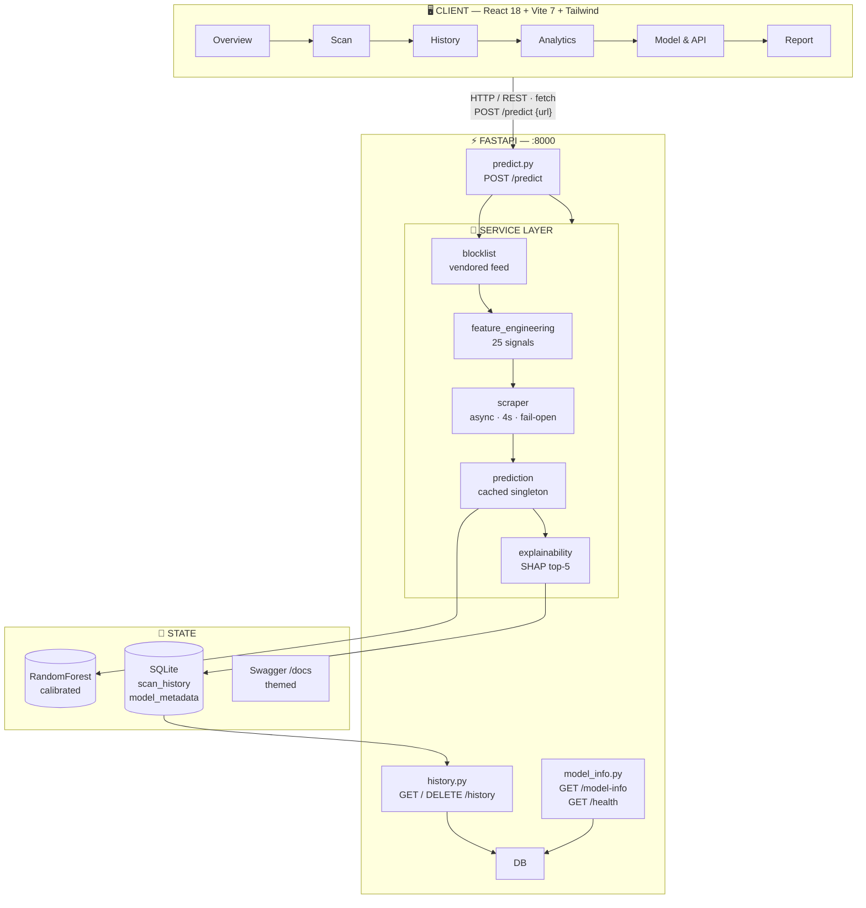
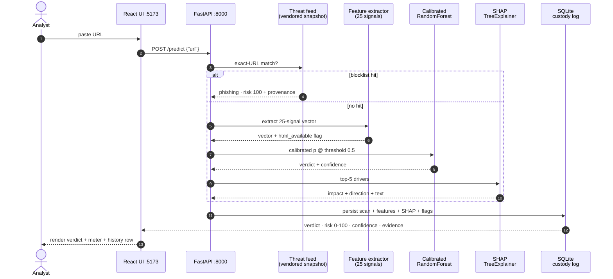
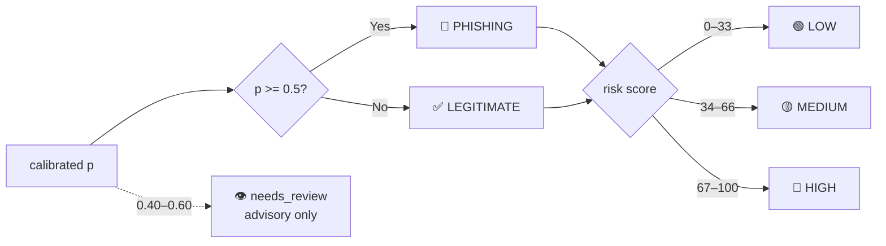
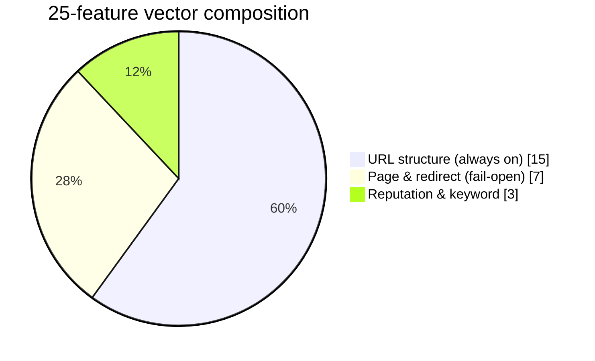
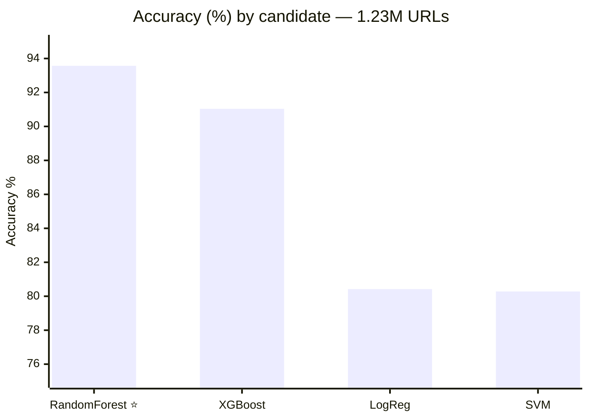
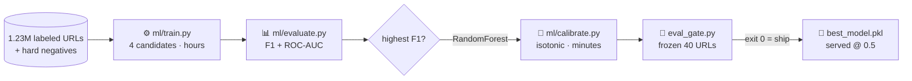

<p align="center">
  
</p>

<h1 align="center">PhishGuard</h1>

<p align="center">
  <strong>Intelligent Phishing URL Detection — verdict, risk & evidence in seconds.</strong><br/>
  Paste a URL → get <code>phishing</code> or <code>legitimate</code> with calibrated confidence,<br/>
  a 0–100 risk score, and the SHAP top-5 signals that decided it.
</p>

<p align="center">
  <a href="https://www.python.org/downloads/"></a>
  <a href="phishing_detector/backend/app/main.py"></a>
  <a href="frontend/package.json"></a>
  <a href="frontend/package.json"></a>
  <a href="phishing_detector/backend/requirements.txt"></a>
  <a href="phishing_detector/backend/app/services/explainability.py"></a>
  <a href="phishing_detector/backend/tests/"></a>
  <a href="frontend/package.json"></a>
</p>

<p align="center">
  <a href="#-product-tour">Product Tour</a> •
  <a href="#-why-phishguard">Why PhishGuard</a> •
  <a href="#-system-architecture">Architecture</a> •
  <a href="#-model-performance">Performance</a> •
  <a href="#-quickstart">Quickstart</a> •
  <a href="#-api-reference">API</a> •
  <a href="OVERVIEW.md">Deep-Dive → OVERVIEW.md</a>
</p>

---

## Table of Contents

- [✨ Product Tour](#-product-tour)
- [🎯 Why PhishGuard](#-why-phishguard)
- [🏆 Highlights](#-highlights)
- [🏗️ System Architecture](#️-system-architecture)
- [🔄 How a Scan Works](#-how-a-scan-works)
- [🧬 25-Signal Intelligence](#-25-signal-intelligence)
- [📊 Model Performance](#-model-performance)
- [🛡️ Trust by Design](#️-trust-by-design)
- [🚀 Quickstart](#-quickstart)
- [🔌 API Reference](#-api-reference)
- [🧪 Testing & Quality Gates](#-testing--quality-gates)
- [⚙️ Configuration](#️-configuration)
- [🗂️ Project Structure](#️-project-structure)
- [🗺️ Roadmap](#️-roadmap)
- [🤝 Contributing](#-contributing)
- [📚 Further Reading](#-further-reading)
- [📄 License](#-license)

---

## ✨ Product Tour

> A full scan takes **seconds** — paste a URL, read the verdict and the five signals behind it. No black box. No paid threat API. Every scan is written to a searchable custody log.


### The bench at a glance

The **Overview** page is the intake desk: live bench status (model loaded, database connected, active model version), a quick-scan bar, and the newest exhibits with verdicts and confidence. Everything pulls from the same custody log the API writes to — **no mock layer**.


### A verdict with evidence, not just a label

Each URL runs through a **25-feature hybrid vector** and a **calibrated RandomForest @ threshold 0.5**. The verdict ships with calibrated confidence, a 0–100 risk score (`low` / `medium` / `high`), and the SHAP top-5 signals that decided it.

| ✅ Legitimate | 🚨 Phishing |
|---|---|
|  |  |

### Every scan on record

Every `/predict` persists URL, domain, verdict, confidence, risk, all 25 features, SHAP top-5, review/feed flags, model version, and timestamp. **History** reads that log newest-first with text search, verdict filters, per-row delete, CSV export, and pagination.


### Know the instrument you're trusting

**Analytics** pairs live counters with frozen training evidence — candidate matrix, confusion heatmap, and ROC curves straight from `ml/comparison_report.json` — so the serving decision (highest F1, then ROC-AUC) is auditable from the UI.


### Paperwork a report can carry

**Report** renders the last scan as a print-optimized white forensic sheet — target, executive verdict, SHAP top-5, full 25-feature matrix, and model signature footer — ready for PDF or print.


<p align="right"><a href="#table-of-contents">↑ back to top</a></p>

---

## 🎯 Why PhishGuard

Phishing drives the majority of reported security incidents. Modern campaigns use **short-lived, dynamically generated zero-day domains** that outrun static blacklists. Commercial alternatives need paid API subscriptions, add latency, or flag sites without saying *why*.

| Problem | PhishGuard answer |
|---|---|
| 🐢 **Blacklists are always late** — zero-day domains dodge them | 🧠 **ML on structure, not reputation** — 25 URL + page signals, zero third-party APIs at serve time |
| 📦 **Black-box verdicts** — "malicious" with no reason | 🔍 **SHAP top-5 on every verdict** — raw value, impact, direction, plain-English explanation |
| 📉 **Overconfident scores** — raw forest probabilities mislead | 📐 **Isotonic-calibrated** — Brier 0.0490 → **0.0464**, log-loss 0.1686 → **0.1560** |
| 🧪 **Unverifiable claims** — accuracy numbers with no receipts | 🧾 **Frozen evidence** — training report, calibration report, and 40-URL acceptance gate all versioned in-repo |
| 🕳️ **Scans vanish** — no audit trail | 🗄️ **SQLite custody log** — every scan + features + SHAP + model version, searchable & exportable |

> Original ≥95% accuracy target was aspirational. Shipped model: **93.57% accuracy · 91.40 F1 · 0.9829 ROC-AUC** on **1,225,534 URLs** — documented honestly with calibration analysis.

<p align="right"><a href="#table-of-contents">↑ back to top</a></p>

---

## 🏆 Highlights

| | |
|---|---|
| 🧠 **Serving model** | Calibrated RandomForest · **93.6% accuracy · F1 91.4 · ROC-AUC 0.983** (1.23M URLs, 2026-09-18) |
| 🔍 **Explainable** | SHAP top-5 contributing signals on every verdict — no black box |
| 🛡️ **Trust layers** | Vendored threat-feed pre-filter + advisory review band + frozen acceptance gate |
| ⚡ **Full stack** | FastAPI (async) + React 18 + Vite 7 + Tailwind forensic UI + SQLite custody log |
| ✅ **Quality gates** | 49 backend tests green · `npm audit`: 0 vulnerabilities · `==`-pinned deps |

---

## 🏗️ System Architecture

Three layers, one contract: the UI, the API, and the evidence store all speak the same scan object.



**Request flow:** `POST /predict {"url"}` → threat-feed check → feature extraction → calibrated inference (@ 0.5) → SHAP explanation → review-band flag → persist to SQLite → return verdict + evidence.

<p align="right"><a href="#table-of-contents">↑ back to top</a></p>

---

## 🔄 How a Scan Works

Five stages. The feed outranks the model, the review band never overrides it, and the database remembers everything.



<details>
<summary><strong>📦 Example <code>POST /predict</code> response — click to expand</strong></summary>

```jsonc
// POST /predict {"url": "https://github.com/login"} →
{
  "scan_id": 114,
  "url": "https://github.com/login",
  "domain": "github.com",
  "prediction": "legitimate",   // "phishing" | "legitimate" — never anything else
  "confidence": 0.937,
  "risk_score": 6,              // 0–100
  "risk_level": "low",          // "low" | "medium" | "high"
  "needs_review": false,        // calibrated p inside [0.40, 0.60]?
  "blocklist_hit": false,       // exact match in the threat-feed snapshot?
  "blocklist_source": null,     // e.g. "urlhaus-online" when hit
  "decision_threshold": 0.5,
  "model_version": "randomforest_v2_2026-09-15_064718_calibrated",
  "scanned_at": "2026-09-15T05:37:07Z",
  "top_features": [
    { "name": "domain_in_top_list", "value": true,
      "impact_score": 0.31, "direction": "decreases_risk" }
    // …4 more
  ],
  "features": { "url_length": 24, "domain_length": 6 /* …25 total */ }
}
```

</details>



<p align="right"><a href="#table-of-contents">↑ back to top</a></p>

---

## 🧬 25-Signal Intelligence

A hybrid vector: always-available URL anatomy, fail-open page/redirect evidence, and reputation/keyword tripwires. No third-party threat APIs at serve time. URL-only fallback when the target is offline (`html_features_available` flag).



| Group | Signals | Examples |
|---|---|---|
| 🔗 **A. URL structure** — 15, always available | `url_length` · `domain_length` · `num_dots` · `num_hyphens` · `num_digits` · `num_subdomains` · `has_https` · `has_ip_address` · `has_at_symbol` · `has_double_slash_redirect` · `is_shortened_url` · `num_suspicious_chars` · `url_entropy` · `has_suspicious_tld` · `path_length` | `login.paypal.com.evil.com` (dots) · raw-IP hosts · `bit.ly` obfuscation · Shannon entropy |
| 🌐 **B. Page & redirect** — 7, fail-open | `has_iframe` · `redirect_count` · `num_external_links` · `form_action_suspicious` · `has_javascript_events` · `has_popup_window` · `has_hidden_elements` | Framed phish forms · multi-hop laundering · exfil `form action` · `window.open()` popups |
| 🏛️ **C. Reputation & keyword** — 3, URL-side | `domain_in_top_list` (Cisco Umbrella top-1M) · `has_auth_keyword` · `keyword_domain_mismatch` | Exonerates `github`/`wikipedia` class · `evil.com/paypal-login` shape |

> Full per-feature logic, types, and threat rationale: [`OVERVIEW.md` — Feature engineering](OVERVIEW.md#feature-engineering-25-signals). Contract enforced by `test_extract_all_contains_contract`.

<p align="right"><a href="#table-of-contents">↑ back to top</a></p>

---

## 📊 Model Performance

Four candidates trained on **1,225,534 URLs** (stratified 80/20, `class_weight="balanced"`, no SMOTE; `RandomForest(max_depth=25)` size-bounded). Source of truth: `phishing_detector/backend/ml/comparison_report.json` (2026-09-15). **Selection: highest F1, ROC-AUC breaks ties.**



| Model | Accuracy | Precision | Recall | F1 | ROC-AUC | Role |
|---|---|---|---|---|---|---|
| **RandomForest** ⭐ | **93.57%** | **92.72%** | **90.12%** | **91.40** | **0.9829** | **Selected — ships calibrated** |
| XGBoost | 91.04% | 92.95% | 82.63% | 87.49 | 0.9660 | Runner-up |
| Logistic Regression | 80.42% | 77.20% | 68.61% | 72.65 | 0.8806 | Interpretable baseline |
| SVM (calibrated linear) | 80.28% | 76.41% | 69.41% | 72.74 | 0.8793 | Benchmark (RBF infeasible at scale) |

RandomForest also pairs natively with SHAP `TreeExplainer` for fast local explanations.

### Calibration — honest probabilities

Raw forest scores rank well but run overconfident, so the shipped artifact is **isotonic-calibrated** (`ml/calibrate.py`, no retrain) on 122,553 provably held-out rows.

| Metric (held-out) | Raw | Calibrated |
|---|---|---|
| Accuracy | 93.60% | **93.68%** |
| Precision / Recall / F1 | 92.77 / 90.14 / 91.44 | **94.49** / 88.49 / 91.39 |
| ROC-AUC | 0.9831 | 0.9830 |
| Brier ↓ | 0.0490 | **0.0464** |
| Log-loss ↓ | 0.1686 | **0.1560** |

Threshold stays **0.5** (the frozen gate assumes it). Alternatives + abstain-band analysis live in `ml/calibration_report.json`.



<p align="right"><a href="#table-of-contents">↑ back to top</a></p>

---

## 🛡️ Trust by Design

| Layer | Where | Behavior |
|---|---|---|
| 🚫 **Threat-feed pre-filter** | `app/services/blocklist.py` + `ml/data/feed_blocklist.csv` | Normalized exact-URL match outranks the model (phishing, risk 100) with `blocklist_hit` / `blocklist_source`. No domain expansion — shared hosts stay safe. Refresh: `python ml/refresh_blocklist.py`. Toggle: `BLOCKLIST_ENABLED=false`. |
| 👁️ **Review band** | `needs_review`, defaults `[0.40, 0.60]` | Advisory-only flag for analysts (~3.3% of traffic at ~45% error). **Never changes the verdict.** |
| 🎯 **Operating point** | `DECISION_THRESHOLD=0.5`, echoed by every response + `/model-info` | Change deliberately; gate assumes 0.5. Preview with `eval_gate.py --threshold <t>`. |
| 🚦 **Acceptance gate** | `eval_gate.py` on frozen 40 URLs + `ml/data/eval_gate.json` | Exit 0 ships: ≥85% frozen accuracy, `github.com/login` p < 0.30, zero top-site misses. |
| 🔬 **Retrain readiness** *(unserved)* | `ml/v3_signals.py`, `ml/rdap.py`, `ml/collect_html.py` | `on_free_host` (13.1% phish vs 1.4% legit), RDAP `domain_age_days` (cached, fail-open), resumable HTML corpus — training-side only, 25-feature serving contract untouched. |

---

## 🚀 Quickstart

Get from clone to first verdict in ~5 minutes (plus install time).

### 1️⃣ Prerequisites

| Tool | Version | Notes |
|---|---|---|
| Python | **3.11** | Pinned by `phishing_detector/backend/.python-version`. Not 3.14 — no prebuilt sklearn wheels there |
| [`uv`](https://docs.astral.sh/uv/) | any recent | Reproducible installs (venv is uv-managed, no bare `pip`) |
| Node.js | 20.19+ (tested on 24.x) | Frontend only |
| RAM | 8 GB to serve · 16 GB to train | Artifact ~0.8 GB, loads fully into memory |
| OS | Windows (PowerShell) primarily | macOS/Linux differ only in venv activation |

### 2️⃣ Backend (FastAPI)

```powershell
cd phishing_detector\backend
uv python install 3.11
uv venv --python 3.11 .venv
uv pip install --python .venv\Scripts\python.exe -r requirements.txt -r requirements-dev.txt
.\.venv\Scripts\Activate.ps1
Copy-Item .env.example .env     # real values stay local-only, gitignored
uvicorn app.main:app --reload --port 8000
```

> ⚠️ Use the `uv pip install --python …` form exactly. Bare `pip install` can fall through to another Python (e.g. 3.14) and fail building scikit-learn.

- API: `http://localhost:8000` · Swagger: `http://localhost:8000/docs` · Health: `http://localhost:8000/health`
- Deps are `==`-pinned because the artifact is a pickle — mismatched sklearn/XGBoost/SHAP versions can fail or silently shift predictions. **Retrain before upgrading.**
- Without an artifact the API still runs via deterministic heuristic fallback (`ALLOW_HEURISTIC_FALLBACK=true`) so the UI is demonstrable before training.

### 3️⃣ Frontend (React + Vite)

```powershell
cd frontend
npm install   # first time only
npm run dev   # → http://localhost:5173 (proxies /api → :8000)
```

Production build (also the template check): `npm run build`.

### 4️⃣ Verify

| Check | How | Healthy |
|---|---|---|
| Backend alive | `GET localhost:8000/health` | `{"status":"ok","model_loaded":true,…}` |
| Real model | `GET localhost:8000/model-info` | `"model_name":"RandomForest"` (not `HeuristicFallback`) |
| Predict | `POST localhost:8000/predict` `{"url":"https://github.com/login"}` | `legitimate`, `risk_score` 6, 5 `top_features` |
| UI | `http://localhost:5173` | Overview loads; end-to-end scan works |

<details>
<summary><strong>🧪 Train · calibrate · gate — click to expand</strong></summary>

Training data is **local-only and gitignored**. Place your dataset in `phishing_detector/backend/ml/data/` — the trainer uses the largest `.csv` found there (`hard_negatives.csv` is always appended as extra legitimate rows):

| File in `ml/data/` | Purpose | Committed? |
|---|---|---|
| `phish_urls.csv` (`url,label`) | Labeled dataset | No |
| `reputation_top1m.csv` (`rank,domain`) | Cisco Umbrella top-1M for `domain_in_top_list` | No |
| `hard_negatives.csv` | Curated top-site logins (all `0`) | **Yes** |
| `eval_gate.json` | Frozen 40-URL acceptance set | **Yes** |
| `feed_blocklist.csv` | Vendored URLhaus snapshot | **Yes** |

```powershell
cd phishing_detector\backend
.\.venv\Scripts\Activate.ps1

python -m ml.train            # hours on 1.2M rows → models/best_model.pkl + ml/comparison_report.json
python ml/calibrate.py        # minutes → isotonic-calibrated candidate + ml/calibration_report.json
python eval_gate.py           # exit 0 ships: ≥85% on frozen 40, github/login < 0.30, zero top-site misses
```

Restart the backend after swapping artifacts — the model loads once at startup.

</details>

<p align="right"><a href="#table-of-contents">↑ back to top</a></p>

---

## 🔌 API Reference

| Method | Route | Purpose |
|---|---|---|
| `POST` | `/predict` | `{"url"}` → verdict, confidence, risk 0–100, SHAP top-5, 25-feature vector, review/feed flags; persisted |
| `GET` | `/history?page=&per_page=&prediction=` | Newest-first custody log + pagination |
| `DELETE` | `/history/{scan_id}` | Delete one record (204) |
| `GET` | `/model-info` | Model metrics, training timestamp, active threshold |
| `GET` | `/health` | `status`, `model_loaded`, `database_connected` |
| `GET` | `/docs` | Themed Swagger console |

**Stack:** Python 3.11 · FastAPI (Uvicorn) · scikit-learn + XGBoost + SHAP · Pandas/NumPy/tldextract · SQLite + SQLAlchemy · BeautifulSoup4 · React 18 + Vite 7 + Tailwind + Lucide · Pydantic v2.

---

## 🧪 Testing & Quality Gates

```powershell
# Backend — API contract, features, degradation, feed/review/threshold,
# v3 signals, HTML collector, legacy-DB migration
cd phishing_detector\backend
.\.venv\Scripts\Activate.ps1
python -m pytest tests/ -q

# One file / one test:
pytest tests\test_features.py -v
pytest tests\test_api.py::test_predict_and_history -v

# Frontend
cd frontend
npm run build
```

| Gate | Status |
|---|---|
| Backend pytest | ✅ 49 passing |
| `npm audit` | ✅ 0 vulnerabilities |
| Frozen acceptance gate | 🚦 `eval_gate.py` exit 0 = ship |
| Deps | 📌 `==`-pinned runtime + dev |

---

## ⚙️ Configuration

Copy `phishing_detector/backend/.env.example` → `.env` (gitignored):

| Variable | Default | Meaning |
|---|---|---|
| `DATABASE_URL` | `sqlite:///./phishguard.db` | SQLite file, auto-created + auto-migrated on startup |
| `MODEL_PATH` | `models/best_model.pkl` | Trained artifact, relative to `backend/` |
| `MODEL_METADATA_PATH` | `ml/comparison_report.json` | Training report behind `/model-info` |
| `CORS_ORIGINS` | `http://localhost:5173` | Allowed frontend origin |
| `ENABLE_HTML_SCRAPING` | `false` | Fetch pages for 7 DOM features (off = URL-only) |
| `SCRAPER_TIMEOUT_SECONDS` | `4.0` | Per-fetch timeout |
| `ALLOW_HEURISTIC_FALLBACK` | `true` | Rule-based verdicts when no artifact exists |
| `LOG_LEVEL` | `INFO` | Verbosity |
| `BLOCKLIST_PATH` / `BLOCKLIST_ENABLED` | `ml/data/feed_blocklist.csv` / `true` | Threat-feed snapshot + toggle |
| `DECISION_THRESHOLD` | `0.5` | Verdict operating point |
| `REVIEW_BAND_LOW` / `REVIEW_BAND_HIGH` | `0.4` / `0.6` | Advisory low-margin band |

Frontend overrides (`frontend/.env.example`): `VITE_API_BASE`, `VITE_API_URL`, `VITE_DOCS_URL` — data fetching always uses the relative `/api` base in dev.

---

## 🗂️ Project Structure

```
PhishGuard/
├── README.md                        # this file — start here
├── OVERVIEW.md                      # system design + architecture deep-dive
├── screenshots/                     # demo.gif + 01–06 product shots
├── frontend/                        # React 18 + Vite 7 + Tailwind
│   └── src/{pages,components,services,utils}  # 6 pages, api client, verdict system
├── phishing_detector/backend/
│   ├── app/{routers,services,models,schemas,core,static}  # API + inference
│   ├── models/                      # best_model.pkl lives here after training (local-only)
│   ├── ml/{train,calibrate,evaluate} # pipeline + calibration + benchmarks
│   ├── ml/{refresh_blocklist,collect_html,rdap,v3_signals}  # feeds + retrain readiness
│   ├── ml/{comparison,calibration}_report.json  # training + calibration evidence
│   ├── ml/data/{eval_gate.json,hard_negatives.csv,feed_blocklist.csv}
│   ├── tests/                       # pytest suite (49 green)
│   ├── eval_gate.py                 # frozen acceptance gate (exit 0 = ship)
│   ├── requirements{,-dev}.txt      # pinned deps (see Quickstart why)
│   └── .env.example                 # copy to .env (see Configuration)
```

Training data (`*.csv` except the three companions above), `*.pkl` artifacts, `*.db` files, and `.env` are local-only and gitignored — regenerated via the steps above.

---

## 🗺️ Roadmap

- [x] 25-signal hybrid vector with URL-only fallback
- [x] Calibrated RandomForest (F1 91.4 · ROC-AUC 0.983) + SHAP top-5
- [x] Threat-feed pre-filter · review band · frozen eval gate
- [x] 6-page forensic bench (Overview → Report) + SQLite custody log
- [ ] Scheduled feed refresh + analyst review queue UI
- [ ] v3 signals (`on_free_host`, RDAP age) behind a shadow-eval harness
- [ ] Auth + multi-analyst workspaces · Postgres option

Have an idea? Open an issue — evidence-first proposals (with a failing URL + expected verdict) get priority.

---

## 🤝 Contributing

1. Fork → branch (`feat/<scope>` or `fix/<scope>`).
2. Backend: `python -m pytest tests/ -q` green. Frontend: `npm run build` clean.
3. New features must update the 25-signal contract test if the vector changes, plus `OVERVIEW.md` if architecture shifts.
4. Open a PR with screenshots for UI changes and a `POST /predict` sample for inference changes.

---

## 📚 Further Reading

- [`OVERVIEW.md`](OVERVIEW.md) — architecture, 25-feature matrix, calibration analysis, trust layers
- `phishing_detector/backend/ml/` — training, calibration, eval gate, and retrain-readiness scripts (`v3_signals.py`, `collect_html.py`, `rdap.py`)
- [`docs/`](docs/) — scenario, SRS, and presentation assets

---

## 📄 License

MIT — see `LICENSE` (or add one before publishing). Training datasets, `*.pkl` artifacts, and `*.db` files are local-only and never distributed with this repo.

---

<p align="center">
  <sub>PhishGuard — <strong>paste a URL, get a verdict with evidence.</strong> Built with FastAPI · React · scikit-learn · SHAP.</sub><br/>
  <sub><a href="#table-of-contents">↑ back to top</a></sub>
</p>
